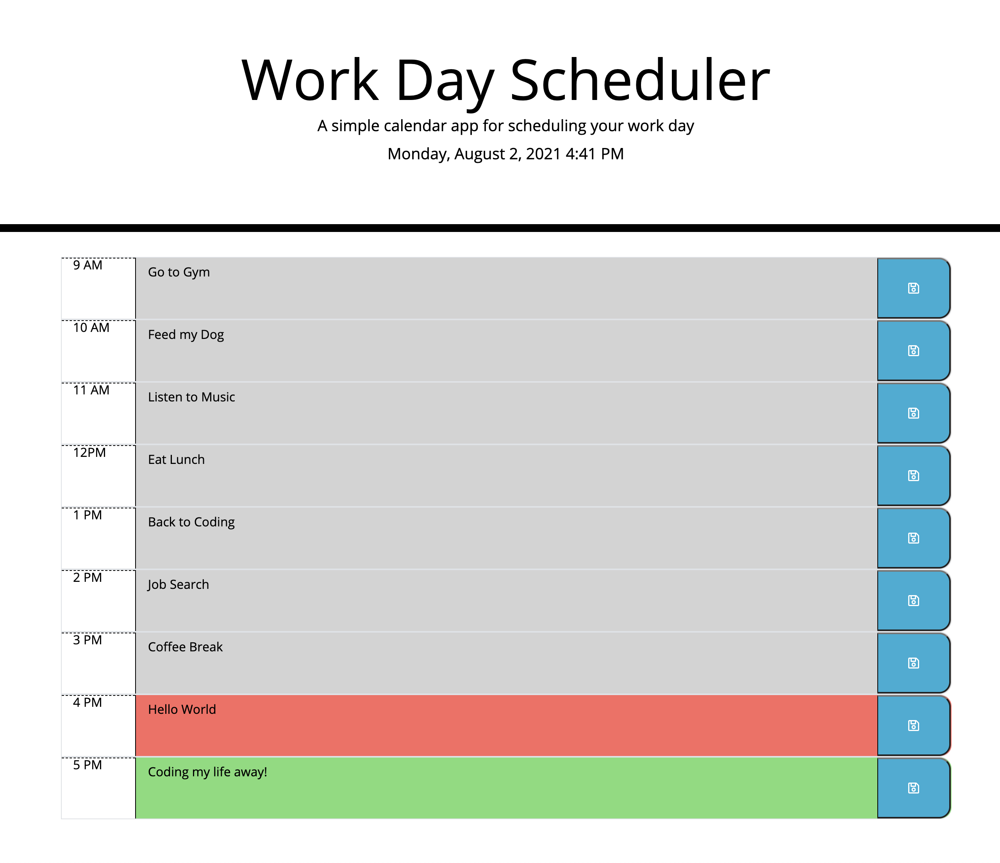

# day-planner

  
  
  
  

  ## Table of Contents 
  * [Description](#Description)
  * [Project URL](#Project-URL)
  * [Mock-up](#Mock-up)
  * [Usage](#Usage)
  * [Credits](#Credits)
  * [License](#License)
  * [Features](#Features)
  * [Tests](#Tests)
  * [Resources](#Resources)
  * [Contact](#Contact)
  * [Designed and built by](#Designed-and-built-by)
  #
  
  ## Description 
  Simple calendar application that allows a user to save events for each hour of the day by modifying starter code. This app will run in the browser and feature dynamically updated HTML and CSS powered by jQuery.

  ## Project URL
  https://johnsonr84.github.io/day-planner/

  ## Mock-Up
  
  <table>
  <tr>
    <td>day-planner demo</td>
  </tr>
  <tr>
    <td></td>
  </tr>
 </table>

  ## Installation 
  No installations required at this time 

  ## Usage 
  No usage requirements

  ## Credits 
  Me, myself and Irene 

  ## License 
  This project is [mit](https://choosealicense.com/licenses/mit/) licensed.

  ## Features
  Coming soon maybe 

  ## Tests
  No tests required at this time 

  ## Resources
  * [Choose a License](https://choosealicense.com/)
  * [Badmath](https://img.shields.io/github/languages/top/nielsenjared/badmath)
  * [shields.io](https://shields.io/)
  * [w3schools](https://www.w3schools.com/)
  * [stackoverflow.com](https://stackoverflow.com/)
  * [YouTube](https://www.youtube.com/)
  * [UOFU-SAN-FSF-PT-11-2020-U-C/03-Javascript/Activities]
  * [Luxon](https://moment.github.io/luxon/)
  * [Day.js](https://day.js.org/)
  * [date-fns](https://date-fns.org/)
  * [js-Joda](https://js-joda.github.io/js-joda/)

  ## Contact
  Email: robertcjohnson1984@gmail.com 

  ## Designed and built by
  Author(s): Rob Johnson  

  GitHub: https://github.com/johnsonr84/ 
